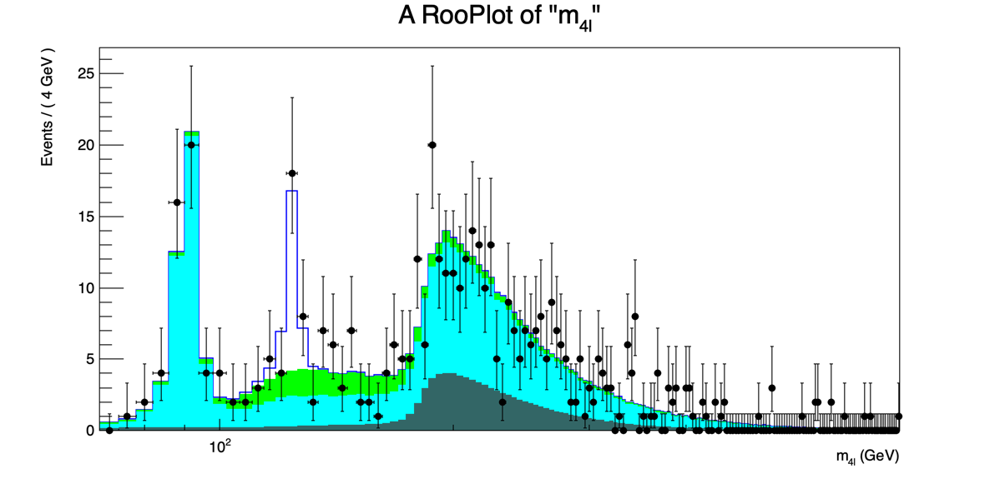

## Exercise #0: Fit the invariant mass spectrum

First, you need a copy of the data
[ROOT](https://twiki.cern.ch/twiki/bin/view/Main/ROOT)
file containing the invariant mass spectrum and the expected signal and background shapes:

```bash
wget https://twiki.cern.ch/twiki/pub/Main/INFNStatRooStats2026/h4l_Dataset_and_shapes.root
```

on
[MacOS](https://twiki.cern.ch/twiki/bin/edit/Main/MacOS?topicparent=Main.INFNStatRooStats2026;nowysiwyg=1)
, you may want to use

```bash
curl -o h4l_Dataset_and_shapes.root https://twiki.cern.ch/twiki/pub/Main/INFNStatRooStats2026/h4l_Dataset_and_shapes.root
```

Let's create a skeleton for a
[PyROOT](https://twiki.cern.ch/twiki/bin/view/Main/PyROOT)
program. Let's call it, for instance,
`exercise_0_h125.py`
, and load the
[ROOT](https://twiki.cern.ch/twiki/bin/view/Main/ROOT)
libraries:


```python
#Import the ROOT libraries
import ROOT
```

Define the observable of the analysis, the invariant mass of the four leptons:

```python
#Define the observable, the 4l invariant mass
m4l = ROOT.RooRealVar("m4l","m_{4l}",70.,1302.,"GeV")
```

Now import the
[ROOT](https://twiki.cern.ch/twiki/bin/view/Main/ROOT)
file containing the data and the lineshapes, and extract the
`RooDataSet`
from it:

```python
#import the data and lineshapes for signal and background
fInput = ROOT.TFile("h4l_Dataset_and_shapes.root")

#this is the run-1 data
unbinned_4l = fInput.Get("unbinned_m4l")
```

Extract from the
[ROOT](https://twiki.cern.ch/twiki/bin/view/Main/ROOT)
file the histograms that describe the signal and background lineshapes (determined from simulation):

```python
#Get the histograms that describe the different contributions to the signal and background
M4l4l_Inclusive_H125Unblinded   = fInput.Get("M4l4l_Inclusive_H125Unblinded")
M4l4l_Inclusive_ggZZUnblinded   = fInput.Get("M4l4l_Inclusive_ggZZUnblinded")
M4l4l_Inclusive_qqZZUnblinded   = fInput.Get("M4l4l_Inclusive_qqZZUnblinded")
M4l_ZX_SS_4l_InclusiveUnblinded = fInput.Get("M4l_ZX_SS_4l_InclusiveUnblinded")
```

The histograms in the file are
`TH1`

[ROOT](https://twiki.cern.ch/twiki/bin/view/Main/ROOT)
objects. In order to use them as PDFs, we need firstly to convert them into a
`RooDataHist`
(the
[RooFit](https://twiki.cern.ch/twiki/bin/view/Main/RooFit)
equivalent of a
`TH1`
) and then create new
`RooHistPdf`
objects that will use them as probability functions:

```python
#Transform the histograms into PDFs. First you have to create a RooDataHist object (a fancy histogram), then create the PDF
h125hist = ROOT.RooDataHist("h125hist","h125hist",ROOT.RooArgList(m4l),M4l4l_Inclusive_H125Unblinded)
pdfh125  = ROOT.RooHistPdf("pdfh125","pdfh125",ROOT.RooArgSet(m4l),h125hist)

ggZZhist = ROOT.RooDataHist("ggZZhist","ggZZhist",ROOT.RooArgList(m4l),M4l4l_Inclusive_ggZZUnblinded)
pdfggZZ  = ROOT.RooHistPdf("pdfggZZ","pdfggZZ",ROOT.RooArgSet(m4l),ggZZhist)

qqZZhist = ROOT.RooDataHist("qqZZhist","qqZZhist",ROOT.RooArgList(m4l),M4l4l_Inclusive_qqZZUnblinded)
pdfqqZZ  = ROOT.RooHistPdf("pdfqqZZ","pdfqqZZ",ROOT.RooArgSet(m4l),qqZZhist)

ZXhist = ROOT.RooDataHist("ZXhist","ZXhist",ROOT.RooArgList(m4l),M4l_ZX_SS_4l_InclusiveUnblinded)
pdfZX  = ROOT.RooHistPdf("pdfZX","pdfZX",ROOT.RooArgSet(m4l),ZXhist)
```

To compose the total PDF, we need 4 variables describing the number of events for each contribution:

```python
#Number of events for signal and backgrounds. The initial value is the expectation from theory+simulation
Nh125 = ROOT.RooRealVar("Nh125","Nh125",19.15,0.0,100.)

NggZZ = ROOT.RooRealVar("NggZZ","NggZZ",68.4,0.1,200.)
NqqZZ = ROOT.RooRealVar("NqqZZ","NqqZZ",317.8,0.1,500.)
NZX   = ROOT.RooRealVar("NZX","NZX",22.9,0.1,200.)
```

We can now construct the total PDF:

```python
#Compose the total PDF
totpdf = ROOT.RooAddPdf("totpdf","totpdf",ROOT.RooArgList(pdfh125,pdfggZZ,pdfqqZZ,pdfZX),ROOT.RooArgList(Nh125,NggZZ,NqqZZ,NZX))
```

Now we can tell
[RooFit](https://twiki.cern.ch/twiki/bin/view/Main/RooFit)
to fit the total PDF using the CMS data. Here,
`Extended`
means that the number of event variables will be treated with Poissonian uncertainties. The printLevel parameter allows you to get more or less information from the fit:

```python
#Do the fit to data, printlevel=1 is the default, with =2 you get the full covariance and correlations
totpdf.fitTo(unbinned_4l,ROOT.RooFit.Extended(1),ROOT.RooFit.PrintLevel(1))
```

We can now plot the result, and save it into a file. We need to plot the data and the total PDF, but
[RooFit](https://twiki.cern.ch/twiki/bin/view/Main/RooFit)
allows you to plot also partial components of the total PDF, for better visualization:

```python
#Plot the result.
#First create a canvass
canvasss = ROOT.TCanvas("canvasss","canvasss",1200,600)

#Create a drawable object and fill it
m4lplot = m4l.frame(308) #Number of bins as an argument
unbinned_4l.plotOn(m4lplot)
totpdf.plotOn(m4lplot)

#One can also plot the single components of the total PDF, like the background component
totpdf.plotOn(m4lplot, ROOT.RooFit.Components("pdfqqZZ,pdfggZZ,pdfZX"), ROOT.RooFit.FillColor(ROOT.kGreen),ROOT.RooFit.DrawOption("F"))
totpdf.plotOn(m4lplot, ROOT.RooFit.Components("pdfqqZZ,pdfggZZ"), ROOT.RooFit.FillColor(ROOT.kCyan),ROOT.RooFit.DrawOption("F"))
totpdf.plotOn(m4lplot, ROOT.RooFit.Components("pdfggZZ"), ROOT.RooFit.FillColor(ROOT.kCyan-1),ROOT.RooFit.DrawOption("F"))

#redraw the data on top of the PDF
unbinned_4l.plotOn(m4lplot)

m4lplot.SetAxisRange(70.,751.)

m4lplot.Draw()

canvasss.SetLogx(1)
canvasss.SaveAs("exercise_0.png")
```

We can now save the data and fitted PDF into a
`RooWorkspace`
so we can use it later:

```python
#Now save the data and the PDF into a Workspace, for later use for statistical analysis
ws = ROOT.RooWorkspace("ws")
getattr(ws,'import')(unbinned_4l)
getattr(ws,'import')(totpdf)

fOutput = ROOT.TFile("Workspace_m4lfit.root","RECREATE")
ws.Write()
fOutput.Write()
fOutput.Close()
```

The result should look similar to this:



### Variable transformation: from number of events to cross section

The number of signal events is not really our parameter of interest. We are more interested in the cross section, because it's better connected with theory predictions.
[RooFit](https://twiki.cern.ch/twiki/bin/view/Main/RooFit)
allows you to perform variable transformations easily. In this case, we want to keep everything the same, but convert
`Nh125`
into a product of variables which are all known apart from the cross section. A function of variables can be expressed in
[RooFit](https://twiki.cern.ch/twiki/bin/view/Main/RooFit)
using the
`RooFormulaVar`
class.

First, copy =exercise_0_h125.py into a new file, and open it:

```bash
cp exercise_0_h125.py exercise_0_h125_xsec.py
```

So substitute the
`Nh125`
variable definition. We assume a selection efficiency of 35%, a branching ratio of H->ZZ of 2%, a branching ratio of Z->2l of 6.2% (only electrons and muons are considered). The collected luminosity for run-1 was 24.8 fb⁻¹.

```python
#Expected number of signal events, based on SM expectations
#Instead of the number of events, we can fit for the cross section with a simple transformation
eff_h125 = ROOT.RooRealVar("eff_h125","The Higgs reco+id efficiency",0.35,0.00001,1.)
lumi = ROOT.RooRealVar("lumi","The CMS luminosity",24800.,0.00001,50000.,"pb⁻¹")
br_hzz = ROOT.RooRealVar("br_hzz","H->ZZ->4l BR",0.02*0.062*0.062)
cross_h125 = ROOT.RooRealVar("cross_h125","The h125 xsec",3.,0.,100.,"pb")

eff_h125.setConstant(1)
lumi.setConstant(1)

#Now define the number of psi events
Nh125 = ROOT.RooFormulaVar("Nh125","@0*@1*@2*@3",ROOT.RooArgList(eff_h125,lumi,br_hzz,cross_h125))
```

The full exercise can be found here:
[exercise_0_h125_xsec.py](code/exercise_0_h125_xsec.py)


## Downloadable code

- [`exercise_0_h125_xsec.py`](code/exercise_0_h125_xsec.py)
