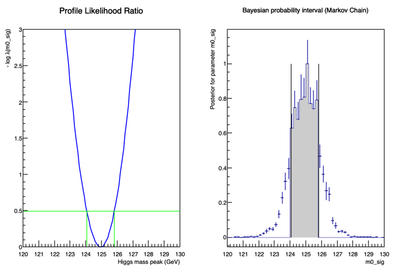

# Exercise 2: Interval for the Higgs mass

Goal: determine the Higgs mass interval using both frequentist and Bayesian approaches.

## Model modification

Replace the histogram signal model with a Crystal Ball function whose mean corresponds to the Higgs mass.

## Techniques

- ProfileLikelihoodCalculator
- MCMCCalculator

## Output

Code:

- `code/exercise_2_hmass.py`
- `code/exercise_2_massInt.py`
