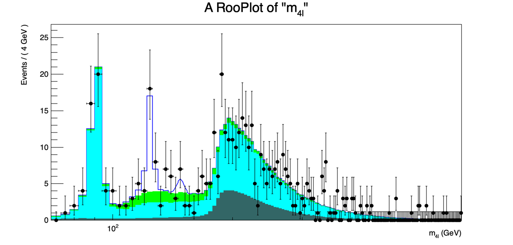
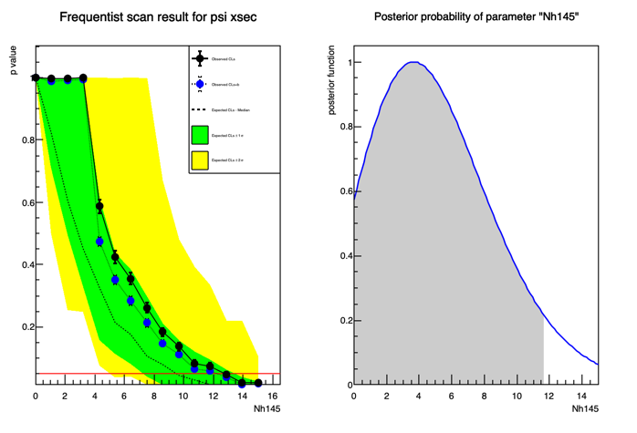

## Exercise #3: Upper limit on a parameter of interest

Let's see if the excess around 145
[GeV](https://twiki.cern.ch/twiki/bin/view/Main/GeV)
is significant. Firstly, we need to modify the fit model to include a possible resonance at 145
[GeV](https://twiki.cern.ch/twiki/bin/view/Main/GeV)
. We will use the
`exercise_0`
macro, and add a lineshape for this excess, assuming the same parameters we used for the Higgs at 125. Firstly, copy the exercise_0_h125.py file so we can modify it:

```bash
cp exercise_0_h125.py exercise_3_newres.py
```

In the new file, we need to add the resonance, just after the definition of the other lineshapes:

```python
#Add a new resonance for 145!
m0_sig   = ROOT.RooRealVar("m0_sig","New resonance mass peak",145.,140.,150.,"GeV")
resol_145  = ROOT.RooRealVar("resol_145","Resolution around the peak",3)
alpha_CB = ROOT.RooRealVar("alpha_CB","Alpha param of CB",2.)
n_CB     = ROOT.RooRealVar("n_CB","N param of CB",1.)

pdfh145 = ROOT.RooCBShape("pdfh145","Signal PDF",m4l,m0_sig,resol_145,alpha_CB,n_CB)
```

We also need a variable to describe the number of events for this new particle. This will be our parameter of interest:

```python
Nh145 = ROOT.RooRealVar("Nh145","Nh145",5.,0.0,15.)
```

And we need to modify the total PDF definition to include it:

```python
totpdf = ROOT.RooAddPdf("totpdf","totpdf",ROOT.RooArgList(pdfh125,pdfggZZ,pdfqqZZ,pdfZX,pdfh145),ROOT.RooArgList(Nh125,NggZZ,NqqZZ,NZX,Nh145))
```

Change the output name of the
`RooWorkspace`
so you do not overwrite the previous one:

```python
fOutput = ROOT.TFile("Workspace_m4lfit_newres.root","RECREATE")
```

and remember to rename the output plot file!

Run the fit, and you'll see that the number of events for the 145 excess is very much compatible with zero. The plot should look similar to this:



You can also run the p-value macro to determine the significance of this excess. Remember to change the input
[RooWorkspace](https://twiki.cern.ch/twiki/bin/edit/Main/RooWorkspace?topicparent=Main.INFNStatRooStats2026;nowysiwyg=1)
, and the name of the parameter of interest to
`Nh124`
!

### Upper limit calculation

We can now calculate the upper limit on this number of events (or of the cross section if you want to do a variable transformation). We will use both CLs and a Bayesian calculator for this.

First create a new file, let's call it
`exercise_3_xsecUL.py`
.

First, import
[ROOT](https://twiki.cern.ch/twiki/bin/view/Main/ROOT)
and open the workspace:

```python
#Import the ROOT libraries
import ROOT

#Open the rootfile and get the workspace
fInput = ROOT.TFile("Workspace_m4lfit_newres.root")
ws = fInput.Get("ws")
ws.Print()
```

Since we are not interested in the 125 Higgs for this part, we will fix its shape (this speeds up the calculations, but it is not necessarily proper for a full analysis):

```python
#Make the h125 shape rigid, for stability and speed
ws.var("m0_sig").setConstant(1)
```

Let's configure the model for
[RooStats](https://twiki.cern.ch/twiki/bin/view/Main/RooStats)
. We need to provide a model for the signal+background hypothesis, and one for the background-only hypothesis:

```python
#Configure the model, we need both the S+B and the B only models
sbModel = ROOT.RooStats.ModelConfig()
sbModel.SetWorkspace(ws)
sbModel.SetPdf("totpdf")
sbModel.SetName("S+B Model")

poi = ROOT.RooArgSet(ws.var("Nh145"))
sbModel.SetParametersOfInterest(poi)

bModel = sbModel.Clone()
bModel.SetPdf("totpdf")
bModel.SetName( sbModel.GetName() + "_with_poi_0")
poi.find("Nh145").setVal(0)
bModel.SetSnapshot(poi)
```

Now we will set up the CLs configuration. There are a few steps: first we create a
`FrequentistCalculator`
, extract its Toy-MC sampler, define a profile likelihood test statistics, and pass it to the
[ToyMC](https://twiki.cern.ch/twiki/bin/edit/Main/ToyMC?topicparent=Main.INFNStatRooStats2026;nowysiwyg=1)
sampler to use for generation:

```python
#First example is with a frequentist approach
fc = ROOT.RooStats.FrequentistCalculator(ws.data("unbinned_m4l"), bModel, sbModel)
fc.SetToys(1000,1000)

#Configure ToyMC Sampler of the frequentist calculator
toymcs = fc.GetTestStatSampler()

#Use profile likelihood as test statistics
profll = ROOT.RooStats.ProfileLikelihoodTestStat(sbModel.GetPdf())
#for CLs (bounded intervals) use one-sided profile likelihood
profll.SetOneSided(1)

#set the test statistic to use for toys
toymcs.SetTestStatistic(profll)
```

We now can ask the calculator for a hypothesis test inversion:

```python
#Create hypotest inverter passing the desired calculator
calc = ROOT.RooStats.HypoTestInverter(fc)

#set confidence level (e.g. 95% upper limits)
calc.SetConfidenceLevel(0.95)

#use CLs
calc.UseCLs(1)

#reduce the noise
calc.SetVerbose(0)
```

Now we can set the number of points and the range to scan for the upper limit in the parameter of interest (
`Nh145`
), and get the upper limit:

```python
npoints = 15 #Number of points to scan
# min and max for the scan (better to choose smaller intervals)
poimin = 0.
poimax = 15.

print("Doing a fixed scan  in interval : ", poimin, " , ", poimax)
calc.SetFixedScan(npoints,poimin,poimax);

result = calc.GetInterval() #This is a HypoTestInveter class object
upperLimit = result.UpperLimit()
```

Now we can move to the Bayesian calculator. First, we need to set a prior PDF for the parameter of interest:

```python
#Example using the BayesianCalculator
#Now we also need to specify a prior in the ModelConfig
#To be quicker, we'll use the PDF factory facility of RooWorkspace
#Careful! For simplicity, we are using a flat prior, but this doesn't mean it's the best choice!
ws.factory("Uniform::prior(Nh145)")
sbModel.SetPriorPdf(ws.pdf("prior"))
```

We will fix most of the parameters in the model. This is generally not recommended because it will ignore their uncertainties, but classic Bayesian methods are very CPU intensive (because of all the integrations necessary), so for this to converge fast enough in this class, we will do so:

```python
#Fix many other parameters. This is not usually correct, but it's necessary for the code to converge in this class.
#In general, for complex problems, standard Bayersian calculators are not recommended, and you can use stuff like the Markov-Chain calculator
ws.var("Nh125").setConstant(1)
ws.var("NZX").setConstant(1)
ws.var("NggZZ").setConstant(1)
ws.var("NqqZZ").setConstant(1)
```

We can now construct the calculator, and get the interval:

```python
#Construct the bayesian calculator
bc = ROOT.RooStats.BayesianCalculator(ws.data("unbinned_m4l"), sbModel)
bc.SetConfidenceLevel(0.95)
bc.SetLeftSideTailFraction(0.) # for upper limit

bcInterval = bc.GetInterval()
```

We can now output the numeric results:

```python
#Now let's print the result of the two methods
#First the CLs
print("################")
print("The observed CLs upper limit is: ", upperLimit)

#Compute expected limit
print("Expected upper limits, using the B (alternate) model : ")
print(" expected limit (median) ", result.GetExpectedUpperLimit(0))
print(" expected limit (-1 sig) ", result.GetExpectedUpperLimit(-1))
print(" expected limit (+1 sig) ", result.GetExpectedUpperLimit(1))
print("################")

#Now let's see what the bayesian limit is
print("Bayesian upper limit on Nh145 = ", bcInterval.UpperLimit())
```

The last step is to plot the CL scan and the posterior PDF for the two methods:

```python
#Plot now the result of the scan

#First the CLs
freq_plot = ROOT.RooStats.HypoTestInverterPlot("HTI_Result_Plot","Frequentist scan result for psi xsec",result)
#Then the Bayesian posterior
bc_plot = bc.GetPosteriorPlot()

#Plot in a new canvasss with style
dataCanvas = ROOT.TCanvas("dataCanvas")
dataCanvas.Divide(2,1)
dataCanvas.SetLogy(0)
dataCanvas.cd(1)
freq_plot.Draw("2CL")
dataCanvas.cd(2)
bc_plot.Draw()
dataCanvas.SaveAs("exercise_3_UL.png")
```

The plot should look similar to this:



You can find the modified mass fit here:
[exercise_3_newres.py](code/exercise_3_newres.py)
.
You can find the modified p-value calculator here:
[exercise_3_pval.py](code/exercise_3_pval.py)
.
You can find the program to calculate the upper limit here:
[exercise_3_xsecUL.py](code/exercise_3_xsecUL.py)


## Downloadable code

- [`exercise_3_newres.py`](code/exercise_3_newres.py)
- [`exercise_3_pval.py`](code/exercise_3_pval.py)
- [`exercise_3_xsecUL.py`](code/exercise_3_xsecUL.py)
