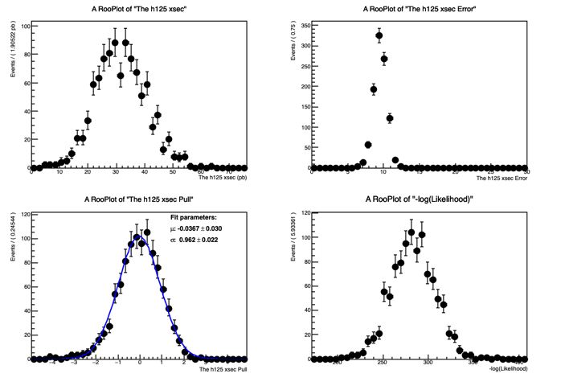

# Exercise 4: Testing parameters with toy-MCs

Goal: study the statistical properties of fitted parameters using toy Monte Carlo experiments.

## Workflow

1. Load the fitted model
2. Generate many pseudo-experiments
3. Fit each toy dataset
4. Study parameter distributions, errors, pulls, and NLL values

## Output

Code:

- `code/exercise_4_toymc.py`
