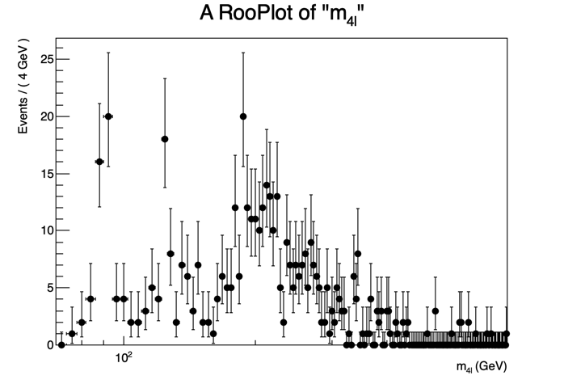

# Exercises for the INFN School of Statistics 2026

The goal of these exercises is to get acquainted with few of the statistical analysis tools mostly used in HEP. Introductory slides will present a general introduction on the main features of
[RooFit](https://twiki.cern.ch/twiki/bin/view/Main/RooFit)
and
[RooStats](https://twiki.cern.ch/twiki/bin/view/Main/RooStats)
, and will give some additional information on the hands-on session.

These exercises use the public Run-1 data from CMS at the LHC, corresponding to about 25 fb⁻¹ of luminosity collected between 2011 and 2012. The purpose is to "discover" the Higgs boson in the 4-lepton final state and characterize its properties.

Our observable is the 4-lepton invariant mass spectrum we will use for most of the exercises:

!!! note
    Do notice that usually experiments do not proceed in this way towards a discovery. In general, blind analyses are performed and the methodology and modelization for data interpretation is decided before looking at the actual data.
    For the purpose of describing the statistical tools in the time frame of this class, we will neglect these considerations for now.

## Reference materials

- [Statistics in Theory](https://indico.cern.ch/event/112319/session/1/contribution/41/material/slides/0.pdf)- a lecture by Bob Cousins
- [Statistical methods in LHC data analysis](http://indico.cern.ch/event/73545/)- Luca Lista
- [RooFit reference slides - by Wouter Verkerke, one of RooFit authors](http://indico.in2p3.fr/materialDisplay.py?contribId=15&materialId=slides&confId=750)
- [RooFit tutorials](http://root.cern.ch/root/html/tutorials/roofit/index.html)- a set of working macros that showcase all major features of[RooFit](https://twiki.cern.ch/twiki/bin/view/Main/RooFit)
- [RooStats Manual](https://twiki.cern.ch/twiki/pub/RooStats/WebHome/RooStats_UsersGuide.pdf)- concise, contains clear summary of statistics concepts and definitions
- [RooStats tutorial - by Kyle Cranmer, one of the RooStats developers](http://indico.cern.ch/getFile.py/access?contribId=0&sessionId=1&resId=0&materialId=slides&confId=118720)
- [RooStats tutorials](http://root.cern.ch/root/html/tutorials/roostats/index.html)- a set of working macros that showcase all major features of[RooStats](https://twiki.cern.ch/twiki/bin/view/Main/RooStats)

## Course exercises

- [Computing environment](setup.md)
- [Exercise 0: Fit the invariant mass spectrum](exercise0.md)
- [Exercise 1: Calculate the p-value of your excess](exercise1.md)
- [Exercise 2: Interval for the Higgs mass](exercise2.md)
- [Exercise 3: Upper limit on a parameter of interest](exercise3.md)
- [Exercise 4: Testing parameters with toy-MCs](exercise4.md)
